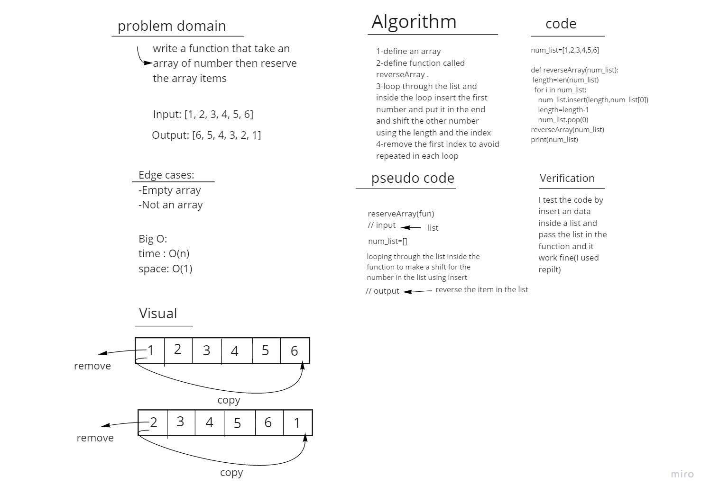

# Reverse an Array

Write a function called **reverseArray** which takes an array as an argument. Without utilizing any of the built-in methods available to your language, return an array with elements in reversed order.

## Whiteboard Process

## Approach & Efficiency
I defined a function and inside it I used a for loop to copy a first index and put it at the end in the list
