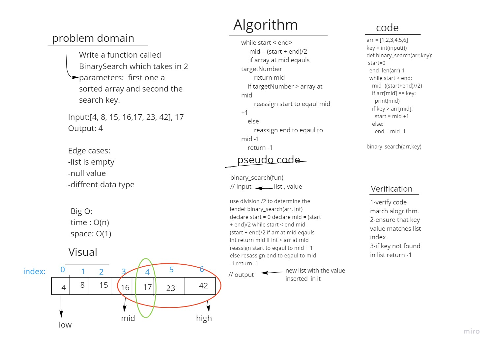

# BinarySearch

Write a function called BinarySearch which takes in 2 parameters: a sorted array and the search key. Without utilizing any of the built-in methods available to your language, return the index of the array’s element that is equal to the value of the search key, or -1 if the element is not in the array.

## Whiteboard Process

## Approach & Efficiency
-declared start, end and mid variables. In a while loop, we check if the mid value matches the int value. If it doesn't, we update our start and end variables to splits the array into halves, until start < end. Once arr[mid] === val, return mid. If the while loop completes without locatin ga match for the target int,  return -1.
