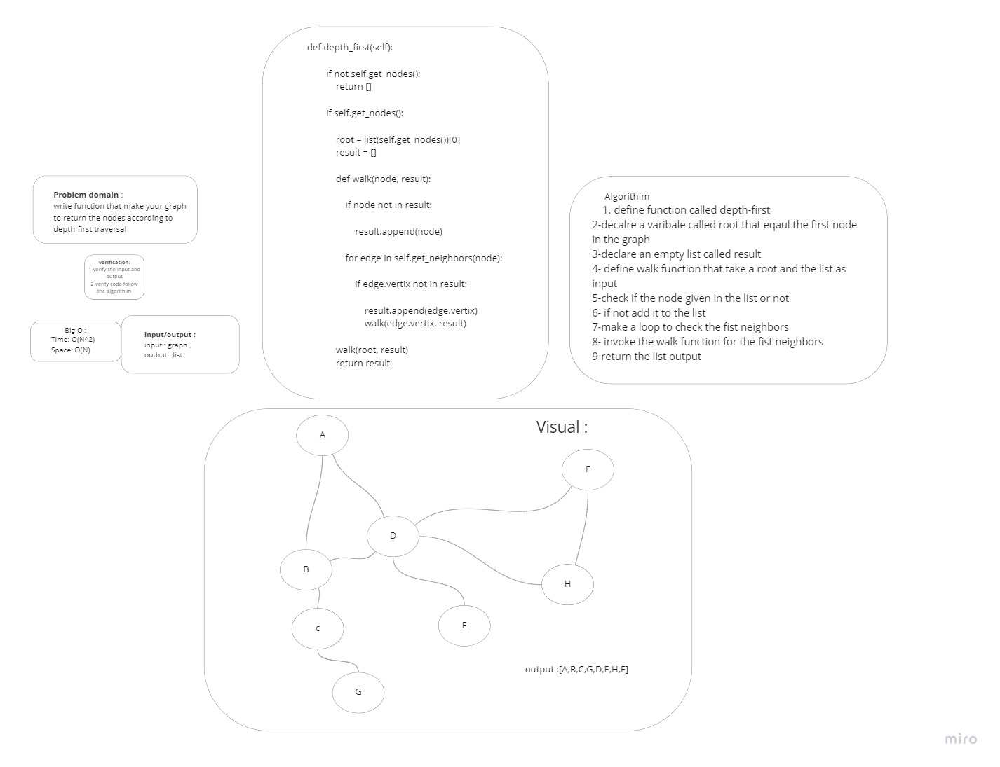

# Challenge Summary
write function that make your graph to return the nodes according to depth-first traversal
## Whiteboard Process

## Approach & Efficiency
time : O(n^2)
space : O(n)
## Solution
```py
    def depth_first(self):

        if not self.get_nodes():
            return []

        if self.get_nodes():

            root = list(self.get_nodes())[0]
            result = []

            def walk(node, result):

                if node not in result:

                    result.append(node)

                for edge in self.get_neighbors(node):

                    if edge.vertix not in result:

                        result.append(edge.vertix)
                        walk(edge.vertix, result)

            walk(root, result)
            return result
```
