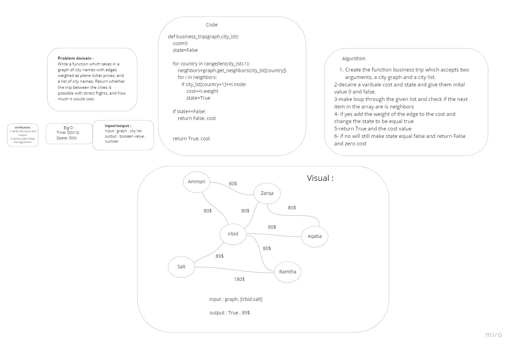

# Challenge Summary
Write a function called business trip Arguments: graph, array of city names Return: cost or null Determine whether the trip is possible with direct flights, and how much it would cost.
## Whiteboard Process


## Approach & Efficiency
Time: O(N^2)
Space: O(N)

## Solution
```py
def business_trip(graph,city_lst):
    cost=0
    state=False

    for country in range(len(city_lst)-1):
        neighbors=graph.get_neighbors(city_lst[country])
        for i in neighbors:
           if city_lst[country+1]==i.node:
               cost+=i.weight
               state=True

    if state==False:
        return False, cost


    return True, cost

```
