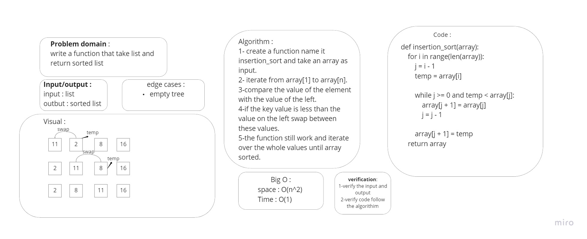

# Challenge Summary
Create function take an array as argument than sort it in Insertion Sort.
## Whiteboard Process

## Approach & Efficiency
Efficency:

- Time: O(n^2)
- Space: O(1)

## Solution

```py
def insertion_sort(array):
    for i in range(len(array)):
        j = i - 1
        temp = array[i]

        while j >= 0 and temp < array[j]:
            array[j + 1] = array[j]
            j = j - 1

        array[j + 1] = temp
    return array

```
