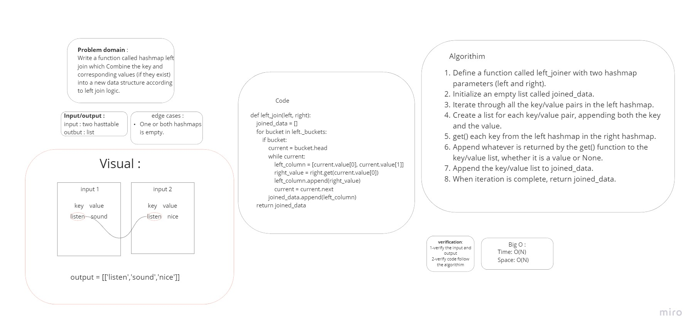

# Hashmap LEFT JOIN
Write a function called left join which combine the key and corresponding values (if they exist) into a new data structure according to left join logic.
## Whiteboard Process

## Approach & Efficiency
Time: O(N)
Space: O(N)
## Solution
```py
def left_join(left, right):
    joined_data = []
    for bucket in left._buckets:
        if bucket:
            current = bucket.head
            while current:
                left_column = [current.value[0], current.value[1]]
                right_value = right.get(current.value[0])
                left_column.append(right_value)
                current = current.next
            joined_data.append(left_column)
    return joined_data
```
