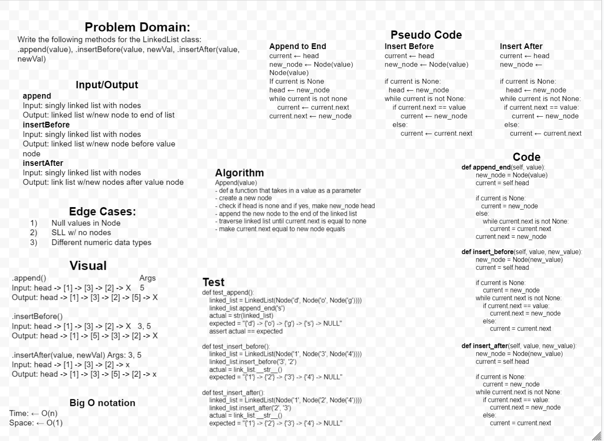
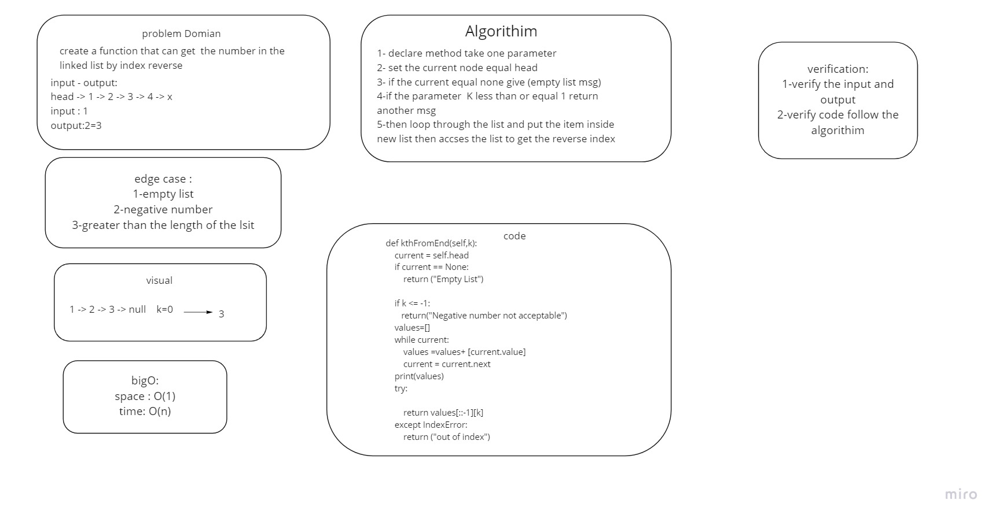

# Singly Linked List

linked list is a group of nodes hat points to each others

## Challenge

a Node class that has properties for the value stored in the Node, and a pointer to the next Node. Within the LinkedList class, a head property included. Upon instantiation, an empty Linked List should be created. Define a method called insert which takes any value as an argument and adds a new node with that value to the head of the list with an O(1) Time performance.

a method called includes which takes any value as an argument and returns a boolean result depending on whether that value exists as a Node’s value somewhere within the list.

a method called string which takes in no arguments and returns a string representing all the values in the Linked List, formatted as: "{ a } -> { b } -> { c } -> NULL"

## Approach & Efficiency

space --> O(n)
time --> O(n)

## API

insert function , which takes any value as an argument and add a node of a value to the head of linked list .

includes function , which takes any value as an argument and Return T/F if value is in the linked list or not

str function , which dose not takes an arguments and returns a string representing all the values in the Linked List.

append function : which adds a new node with the given value to the end of the list

insert before function : which add a new node with the given new value immediately before the first value selected

insert after function : which add a new node with the given new value immediately after the first value selected

kthFromEnd a method for the Linked List class which takes a number, k, as a parameter. Return the node’s value that is k from the end of the linked list.

# whitebord code06

# whiteborad code07

