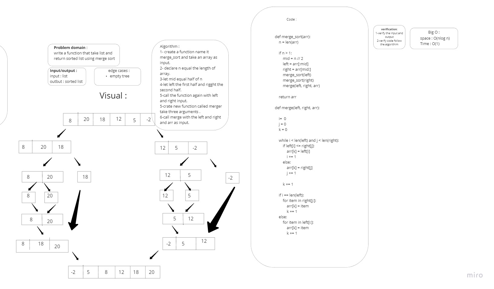

# Challenge Summary
Review the pseudocode below, then trace the algorithm by stepping through the process with the provided sample array. Document your explanation by creating a blog article that shows the step-by-step output after each iteration through some sort of visual.

## Whiteboard Process


## Approach & Efficiency
Big O
Time: O(n*log n)
Space: O(1)

## Solution

```py
def merge_sort(arr):
    n = len(arr)

    if n > 1:
        mid = n // 2
        left = arr[:mid]
        right = arr[mid:]
        merge_sort(left)
        merge_sort(right)
        merge(left, right, arr)

    return arr

def merge(left, right, arr):

    i=  0
    j = 0
    k = 0

    while i < len(left) and j < len(right):
        if left[i] <= right[j]:
            arr[k] = left[i]
            i += 1
        else:
            arr[k] = right[j]
            j += 1

        k += 1

    if i == len(left):
        for item in right[j:]:
            arr[k] = item
            k += 1
    else:
        for item in left[i:]:
            arr[k] = item
            k += 1


```
