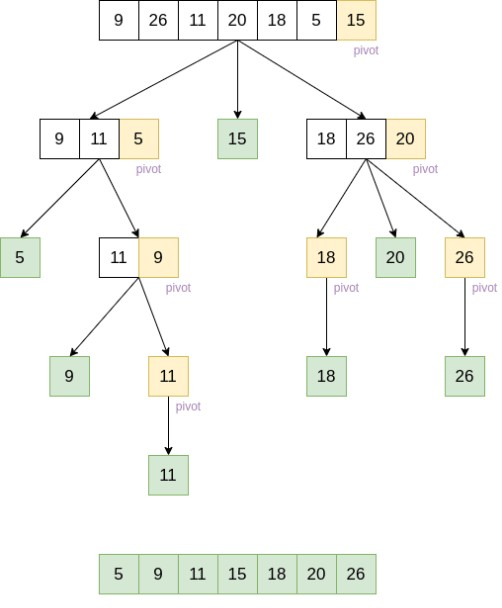

# Quick Sort

Quick sort is a sorting algorithm that recursively traverses through a list using a partition helper function. Both the outer quick sort function and the inner partition function operate on left and right indexing values in addition to the list itself. With each iteration of the partition function, a for loop is used to check against the value of a pivot element within the list which incrementally shifted as the partition function changes the boundary of where the partition in the list occurs. List elements are sorted relative to this pivot value until the partition reaches the middle index value of the list.

The Swap subfunction depicted below is an optional construct that can be functionally incorporated within partition.

Pseudocode

```
ALGORITHM QuickSort(arr, left, right)
    if left < right
        // Partition the array by setting the position of the pivot value
        DEFINE position <-- Partition(arr, left, right)
        // Sort the left
        QuickSort(arr, left, position - 1)
        // Sort the right
        QuickSort(arr, position + 1, right)

ALGORITHM Partition(arr, left, right)
    // set a pivot value as a point of reference
    DEFINE pivot <-- arr[right]
    // create a variable to track the largest index of numbers lower than the defined pivot
    DEFINE low <-- left - 1
    for i <- left to right do
        if arr[i] <= pivot
            low++
            Swap(arr, i, low)

     // place the value of the pivot location in the middle.
     // all numbers smaller than the pivot are on the left, larger on the right.
     Swap(arr, right, low + 1)
    // return the pivot index point
     return low + 1

ALGORITHM Swap(arr, i, low)
    DEFINE temp;
    temp <-- arr[i]
    arr[i] <-- arr[low]
    arr[low] <-- temp

```
Trace


