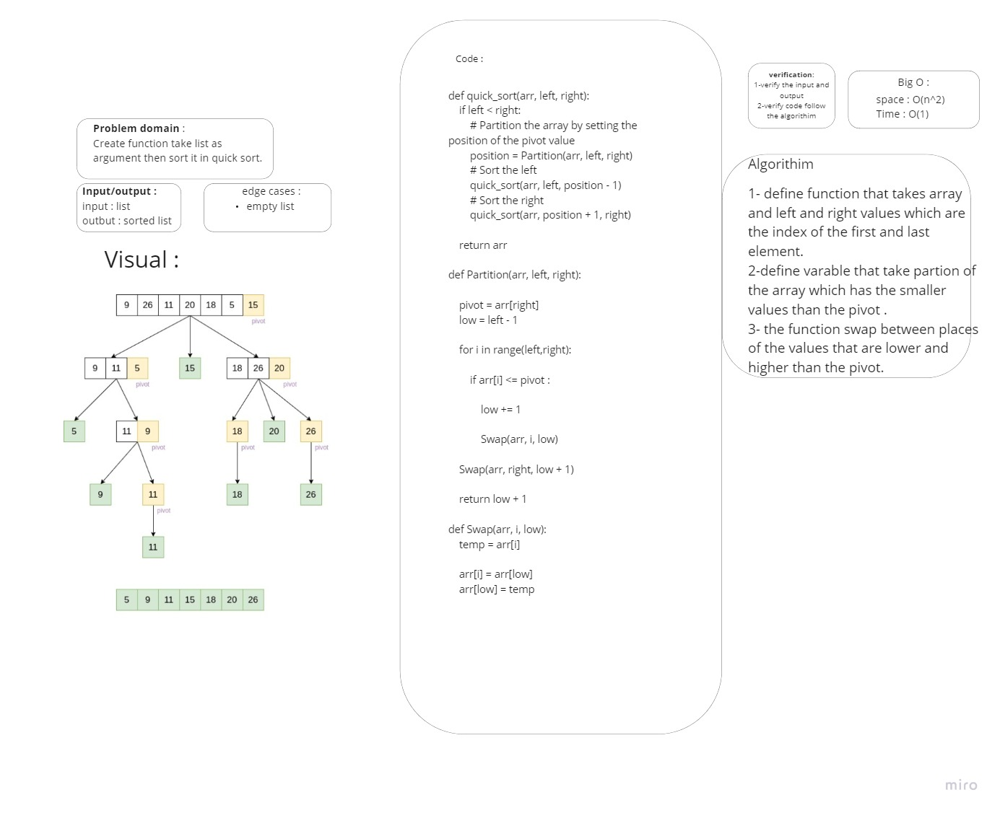

# Challenge Summary
Create function take list as argument then sort it in quick sort.

## Whiteboard Process


## Approach & Efficiency

Big O:
Time: O(n^2)
Space: O(1)

## Solution


```py
def quick_sort(arr, left, right):
    if left < right:
        # Partition the array by setting the position of the pivot value
        position = Partition(arr, left, right)
        # Sort the left
        quick_sort(arr, left, position - 1)
        # Sort the right
        quick_sort(arr, position + 1, right)

    return arr

def Partition(arr, left, right):

    pivot = arr[right]
    low = left - 1

    for i in range(left,right):

        if arr[i] <= pivot :

            low += 1

            Swap(arr, i, low)

    Swap(arr, right, low + 1)

    return low + 1

def Swap(arr, i, low):
    temp = arr[i]

    arr[i] = arr[low]
    arr[low] = temp

```
