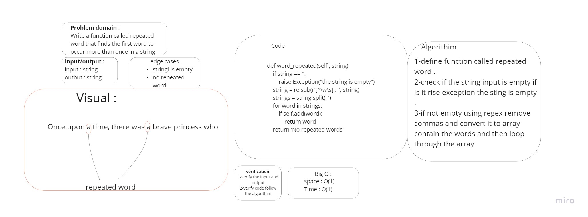

# Challenge Summary
Write a function called repeated word that finds the first word to occur more than once in a string

## Whiteboard Process


## Approach & Efficiency
Time: O(1)
Space: O(1)

## Solution
```py
    def word_repeated(self , string):
        if string == '':
            raise Exception("the string is empty")
        string = re.sub(r'[^\w\s]', '', string)
        strings = string.split(' ')
        for word in strings:
            if self.add(word):
                return word
        return 'No repeated words'
```
