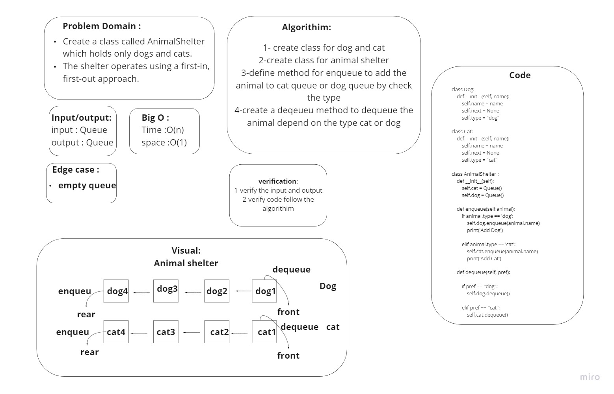

# Challenge Summary
Create a class called AnimalShelter which holds only dogs and cats. The shelter operates using a first-in, first-out approach.
## Whiteboard Process


## Approach & Efficiency
create class for dog and cat and create class for animal shelter,define method for enqueue to add the animal to cat queue or dog queue by check the type,create a deqeueu method to dequeue the animal depend on the type cat or dog.

## Solution
```py

from for_import import Queue

class Dog:
    def __init__(self, name):
        self.name = name
        self.next = None
        self.type = "dog"

class Cat:
    def __init__(self, name):
        self.name = name
        self.next = None
        self.type = "cat"

class AnimalShelter :
    def __init__(self):
        self.cat = Queue()
        self.dog = Queue()

    def enqueue(self,animal):
        if animal.type == 'dog':
            self.dog.enqueue(animal.name)
            print('Add Dog')

        elif animal.type == 'cat':
            self.cat.enqueue(animal.name)
            print('Add Cat')

    def dequeue(self, pref):

        if pref == "dog":
            self.dog.dequeue()

        elif pref == "cat":
            self.cat.dequeue()
        else:
            return 'Null'

```
