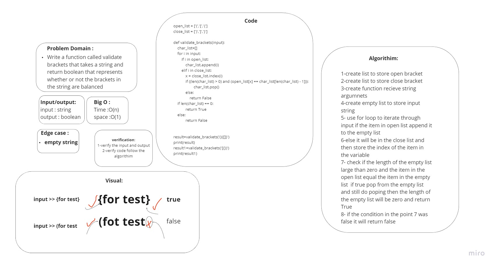

# Challenge Summary
Write a function called validate brackets , Arguments: string , Return: boolean that represents whether or not the brackets in the string are balanced.

## Whiteboard Process


## Approach & Efficiency
used stack to check is the brackets are balanced. Each time a bracket is found, push it to the stack, and when a closed matching bracket is found, match it with the top of the stack and pop it. If stack is empty at the end, return True, else False.
## Solution

```py
open_list = ['(','[','{']
close_list = [')',']','}']

def validate_brackets(str):
    char_list=[]
    for i in str:
        if i in open_list:
            char_list.append(i)
        elif i in close_list:
            x = close_list.index(i)
            if ((len(char_list) > 0) and (open_list[x] == char_list[len(char_list) - 1])):
                    char_list.pop()
            else:
                return False
    if len(char_list) == 0:
            return True
    else:
            return False

```
