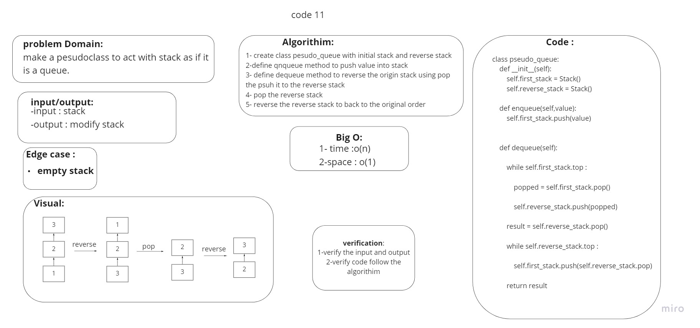

# Challenge Summary
Make a queue data structure using two stack data structure instances.

## Whiteboard Process


## Approach & Efficiency
To enqueue a value to the pseudo queue all values are popped into a second stack, the value is pushed to the top of the second stack and then all values are popped from the second stack back into the first stack. To dequeue a value from the pseudo queue the top of the first stack is popped off.
## Solution

```py

class Pseudo_queue:
    def __init__(self):
        self.first_stack = Stack()
        self.reverse_stack = Stack()

    def enqueue(self,value):
        self.first_stack.push(value)


    def dequeue(self):

        while self.first_stack.top :

            popped = self.first_stack.pop()

            self.reverse_stack.push(popped)

        result = self.reverse_stack.pop()

        while self.reverse_stack.top :

            self.first_stack.push(self.reverse_stack.pop)

        return result
```
