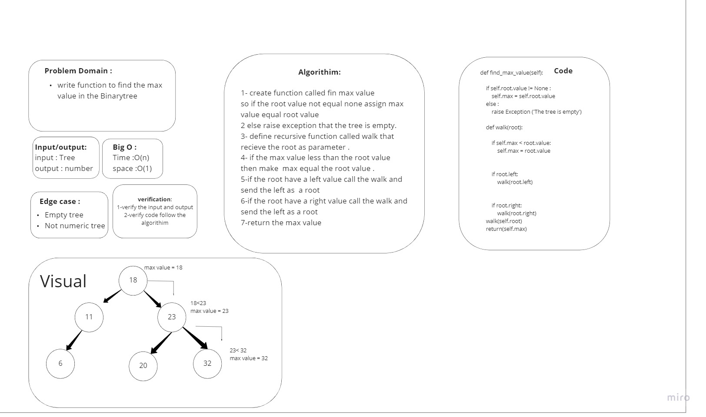
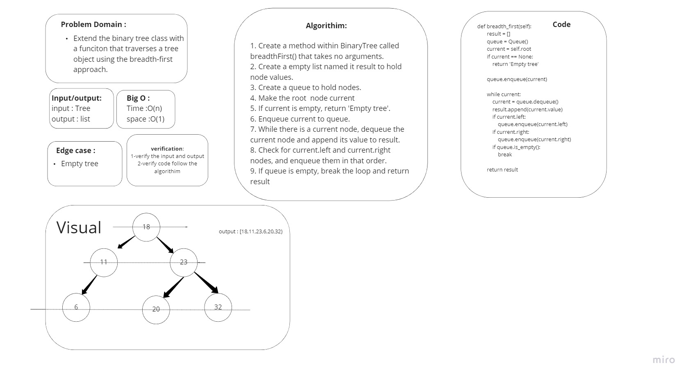

# Trees
A tree data structure can be defined recursively as a collection of nodes (starting at a root node), where each node is a data structure consisting of a value, together with a list of references to nodes (the “children”), with the constraints that no reference is duplicated, and none points to the root.

## Challenge
- Write instance methods of a Binary Tree pre-order, in-order and post-order which show a list of the tree values in these traversal orders.
- Write instance methods of a Binary Search Tree add and contains which update and read a Binary Search Tree for a value.
- write method in BinaryTree class that find the maximum value in a numaric tree

## Approach & Efficiency
BST contain : O(h) , BST add : O(n) , Pre_order : O(n) , Post_order : O(n), In_order : O(n)

## API
pre_order : display data in pre order
In_order : display data in in order
Post_order : display data in Post order
add : add a value to the BST tree
contains : check if the value in BST
find_max : to find the max value in the tree

# WhiteBoard

## code challange 16

## code challange 17

