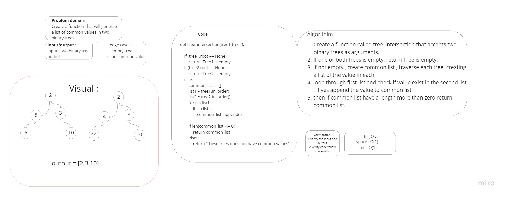

# Challenge Summary
Create a function that will generate a list of common values in two binary trees.


## Whiteboard Process


## Approach & Efficiency
Time: O(n^2)
Space: O(n)

## Solution
```py
def tree_intersection(tree1,tree2):

    if (tree1.root == None):
        return 'Tree1 is empty'
    if (tree2.root == None):
        return 'Tree2 is empty'
    else:
        common_list  = []
        list1 = tree1.in_order()
        list2 = tree2.in_order()
        for i in list1:
            if i in list2:
                common_list .append(i)

        if len(common_list ) != 0:
            return common_list
        else:
            return 'These trees does not have common values'
```
